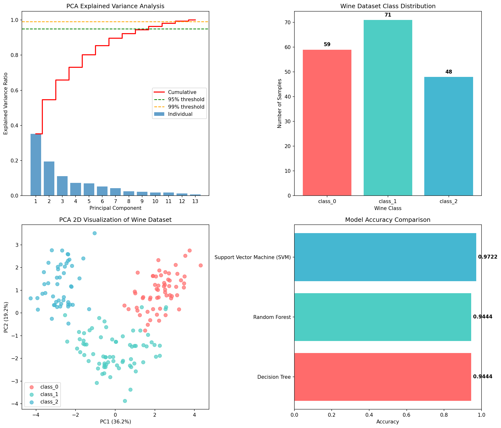

# 🍷 Wine Classification with PCA & Model Deployment

## DATA SCIENCE FINAL LAB EXAM – VARIANT 1

**Author:** Jahanzaib Channa  
**Dataset:** Wine Dataset (Multiclass Classification)  
**Marks:** 15 Marks

---

## 🌐 Live Demo

[](https://wine-classification-project.streamlit.app)

---

## 📋 Table of Contents

- [Overview](#overview)
- [Project Structure](#project-structure)
- [Installation](#installation)
- [Task Breakdown](#task-breakdown)
- [How to Run](#how-to-run)
- [Streamlit Cloud Deployment](#streamlit-cloud-deployment)
- [Technologies Used](#technologies-used)

---

## 📖 Overview

This project implements an **advanced multiclass classification pipeline** using the Wine dataset from scikit-learn. The complete solution includes:

- ✅ Data Loading, Cleaning & Exploration
- ✅ Preprocessing, Scaling & Stratified Split
- ✅ PCA Analysis (Dimensionality Reduction)
- ✅ Model Training (Decision Tree, Random Forest, SVM)
- ✅ Model Evaluation & Comparison
- ✅ Model Deployment using Streamlit

---

## 📁 Project Structure

```
wine_classification_project/
│
├── wine_classification.py    # Main Python script (Tasks a-d)
├── streamlit_app.py          # Streamlit web application (Task e)
├── README.md                 # Project documentation
├── requirements.txt          # Python dependencies
│
├── best_wine_model.pkl       # Saved best model (generated)
├── scaler.pkl                # Saved StandardScaler (generated)
├── pca_model.pkl             # Saved PCA model (generated)
├── model_metadata.pkl        # Model metadata (generated)
│
└── wine_classification_analysis.png  # Visualization (generated)
```

---

## ⚙️ Installation

### Prerequisites

Make sure you have Python 3.8+ installed on your system.

### Step 1: Clone the Repository

```bash
git clone https://github.com/jahanzaib-codes/wine_classification_project.git
cd wine_classification_project
```

### Step 2: Create Virtual Environment (Optional but Recommended)

```bash
python -m venv venv

# Windows
venv\Scripts\activate

# Linux/Mac
source venv/bin/activate
```

### Step 3: Install Required Packages

```bash
pip install -r requirements.txt
```

---

## 📚 Task Breakdown

### Task A: Data Loading, Cleaning & Exploration (2 Marks)

1. ✅ Load the Wine dataset
2. ✅ Display shapes of X and y
3. ✅ Convert to Pandas DataFrame and show:
   - First 5 rows
   - Summary statistics
4. ✅ Display class distribution using `value_counts()`
5. ✅ Determine if dataset is balanced

### Task B: Preprocessing, Scaling & Stratified Split (2 Marks)

1. ✅ Standardize all features using `StandardScaler`
2. ✅ Split dataset into 80% training and 20% testing
3. ✅ Use stratified sampling

### Task C: PCA Analysis (3 Marks)

1. ✅ Apply PCA and determine:
   - Components needed for 95% variance
   - Components needed for 99% variance
2. ✅ Transform training and testing data using 95% variance PCA
3. ✅ Display explained variance values numerically

### Task D: Model Training, Evaluation & Comparison (3 Marks)

Train the following classifiers:
- ✅ Decision Tree
- ✅ Random Forest Classifier
- ✅ Support Vector Machine (SVM)

For each model:
1. ✅ Report test accuracy
2. ✅ Display confusion matrix
3. ✅ Identify best-performing classifier with justification

### Task E: Model Deployment using Streamlit (5 Marks)

1. ✅ Save the best-trained model using joblib
2. ✅ Create Streamlit application that:
   - Accepts wine chemical properties as input
   - Loads the saved model
   - Predicts the wine class (0, 1, or 2)
3. ✅ Display prediction result clearly in the app

---

## 🚀 How to Run Locally

### Step 1: Train Models and Generate Analysis

```bash
python wine_classification.py
```

This will:
- Train all models
- Display analysis in console
- Save the best model (`best_wine_model.pkl`)
- Save the scaler (`scaler.pkl`)
- Save the PCA model (`pca_model.pkl`)
- Generate visualization (`wine_classification_analysis.png`)

### Step 2: Run Streamlit Application

```bash
streamlit run streamlit_app.py
```

This will open the web application in your default browser at `http://localhost:8501`

---

## ☁️ Streamlit Cloud Deployment

### Step-by-Step Deployment Guide

#### Step 1: Go to Streamlit Cloud

Visit [share.streamlit.io](https://share.streamlit.io)

#### Step 2: Sign In

Sign in with your **GitHub account**

#### Step 3: Create New App

1. Click **"New app"** button
2. Select your repository: `jahanzaib-codes/wine_classification_project`
3. Select branch: `main`
4. Main file path: `streamlit_app.py`
5. Click **"Deploy!"**

#### Step 4: Wait for Deployment

- Streamlit will automatically install dependencies from `requirements.txt`
- The app will be deployed and you'll get a public URL

#### Your App URL will be:

```
https://wine-classification-project.streamlit.app
```

or

```
https://[your-app-name].streamlit.app
```

---

### 📝 Important Notes for Deployment

1. **requirements.txt** - Streamlit Cloud uses this file to install dependencies
2. **Model files (.pkl)** - These are included in the repo and will be used by the app
3. **Free tier** - Streamlit Cloud is FREE for public repositories

---

## 📊 Model Performance Summary

| Model | Accuracy |
|-------|----------|
| Decision Tree | ~94.44% |
| Random Forest | ~94.44% |
| **SVM (Best)** | **~97.22%** |

---

## 📈 Visualizations



---

## 📝 Wine Dataset Features

The Wine dataset contains 13 chemical properties:

| # | Feature | Description |
|---|---------|-------------|
| 1 | Alcohol | Alcohol content (%) |
| 2 | Malic Acid | Malic acid concentration |
| 3 | Ash | Ash content |
| 4 | Alcalinity of Ash | Alcalinity of ash |
| 5 | Magnesium | Magnesium content |
| 6 | Total Phenols | Total phenolic compounds |
| 7 | Flavanoids | Flavanoid content |
| 8 | Nonflavanoid Phenols | Non-flavanoid phenols |
| 9 | Proanthocyanins | Proanthocyanin content |
| 10 | Color Intensity | Color intensity |
| 11 | Hue | Hue (color ratio) |
| 12 | OD280/OD315 | OD280/OD315 ratio |
| 13 | Proline | Proline amino acid |

---

## 🛠️ Technologies Used

| Technology | Purpose |
|------------|---------|
| Python 3.x | Programming Language |
| NumPy | Numerical Computing |
| Pandas | Data Manipulation |
| Matplotlib | Visualization |
| Seaborn | Statistical Visualization |
| Scikit-learn | Machine Learning |
| Joblib | Model Serialization |
| Streamlit | Web App Framework |

---

## 🎓 Author

**Jahanzaib Channa**  
Data Science Final Lab Exam – Variant 1

---

## 📄 License

This project is created for educational purposes as part of a Final Lab Exam.
